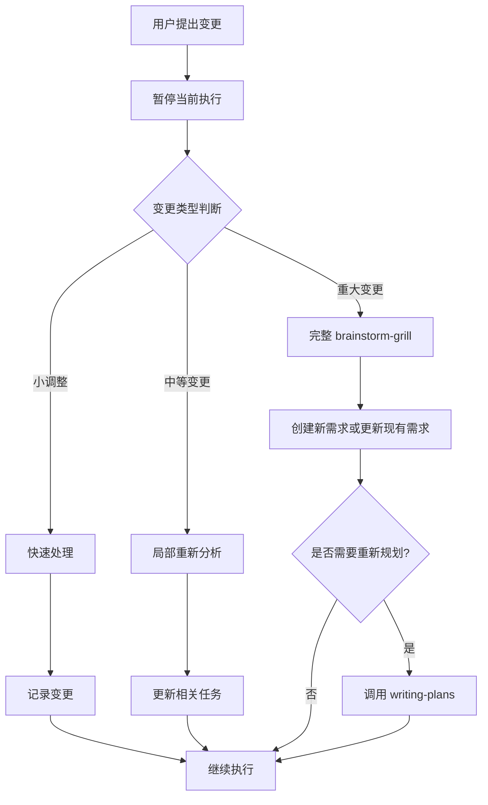

# 需求变更处理流程

当用户在任务执行过程中提出需求修改时，暂停当前执行，启动完整的变更分析和审查流程。

## 触发条件

- 用户在任务执行中说"等等，我想要..."
- 用户说"能不能改成..."
- 用户说"还需要添加..."
- 用户提出任何与当前计划偏离的新需求

## 核心流程



## 变更分类

### 1. 小调整（5分钟内）

**特征**：
- 文案修改
- 样式微调
- 变量重命名
- 不影响架构的细微改动

**处理方式**：
```
[变更记录]
类型: 小调整
描述: [用户描述]
影响: 无架构影响
操作: 直接执行并记录
```

### 2. 中等变更（影响当前任务）

**特征**：
- 新增/修改一个功能点
- 影响当前正在执行的1-2个任务
- 不需要重新设计整体架构

**处理方式**：
1. **暂停执行**
2. **局部分析**（使用 Grill-me 风格）：
   - 这个变更会影响哪些已完成的部分？
   - 是否需要回退某些改动？
   - 对后续任务有什么影响？
3. **更新任务列表**：
   - 标记受影响的任务
   - 添加/修改相关任务
4. **继续执行**

### 3. 重大变更（影响整体设计）

**特征**：
- 新增完整功能模块
- 改变核心架构
- 影响多个已完成的任务
- 需要重新思考实现方式

**处理方式**：
1. **暂停执行**
2. **启动完整 brainstorm-grill 流程**：
   - 阶段1: 理解变更的真实需求
   - 阶段2: 评估对现有设计的影响
   - 阶段3: 提出调整方案
   - 阶段4: 审查方案的完整性
3. **创建/更新需求**：
   - 如果是全新需求 → 创建新 REQ
   - 如果是现有需求调整 → 更新现有 REQ
4. **更新执行计划**：
   - 调用 writing-plans 更新计划
   - 或创建新的执行计划
5. **确认后继续执行**

## 执行步骤

### 步骤1: 确认变更

向用户确认：
> "你提出的是：[变更描述]。让我先暂停当前执行，分析一下这个变更的影响。"

### 步骤2: 分类变更

通过以下问题快速分类：
1. 这个变更是否影响已完成的功能？
2. 这个变更是否需要改变整体架构？
3. 这个变更能否在30分钟内完成？

**分类逻辑**：
- 3个"否" → 小调整
- 1-2个"是" → 中等变更
- 全部"是" → 重大变更

### 步骤3: 执行对应流程

#### 小调整流程
```
✓ 直接执行变更
✓ 在执行报告中记录
✓ 继续原有任务
```

#### 中等变更流程
```
1. Grill-me 式快速审查：
   > "这个变更会影响[任务A]和[任务B]。我建议先回退[任务B]的部分改动，然后..."
2. 更新 TodoWrite
3. 继续执行
```

#### 重大变更流程
```
1. 完整 Brainstorm-grill 分析
2. 生成变更分析文档
3. 更新需求文档
4. 重新规划执行计划
5. 确认后继续
```

### 步骤4: 记录变更

无论哪种变更，都要记录到 `CHANGELOG.md`：

```markdown
## 执行中变更

### [时间] - [变更类型]

**原因**: [用户提出的原因]

**变更内容**:
- [具体变更项1]
- [具体变更项2]

**影响分析**:
- 受影响任务: [任务列表]
- 回退内容: [如有]
- 新增任务: [如有]

**决策依据**: [brainstorm-grill 分析结果]
```

## NEVER 清单

- **绝不**未经分析就执行重大变更
- **绝不**忽略变更对已完成任务的影响
- **绝不**在未确认的情况下删除已完成的工作
- **绝不**跳过变更记录
- **绝不**让变更"悄悄"发生而不通知用户

## 示例对话

### 小调整示例
> 用户: "等等，这个按钮的文字改成'提交'不要用'保存'"
>
> AI: 明白了，这是个小调整。让我直接改... ✓ 完成。已记录到变更日志，继续执行任务3。

### 中等变更示例
> 用户: "我想再加一个验证码功能"
>
> AI: 好的，让我暂停执行。这个变更会影响当前的任务4（表单提交）和任务5（后端接口）。
>
> 我建议：
> 1. 先完成任务1-3（不受影响）
> 2. 在任务4之前插入新任务：实现验证码功能
> 3. 调整任务4和5以适配验证码
>
> 这样可以吗？

### 重大变更示例
> 用户: "其实我想要实时协作功能，而不是表单提交"
>
> AI: 这是一个重大变更，会改变整个架构。让我启动深度分析...
>
> [启动 brainstorm-grill]
>
> 分析完成。实时协作需要：
> - WebSocket 连接管理
> - 操作同步机制
> - 冲突解决策略
>
> 我建议：
> 1. 将当前工作保存为"单机模式"分支
> 2. 创建新需求 REQ-XXX: 实时协作功能
> 3. 重新规划实现方案
>
> 你想继续哪个方向？

## 集成说明

此 skill 应在以下情况下被调用：
- executing-plans 执行过程中
- 用户提出偏离当前计划的任何修改
- 发现原计划有重大缺陷需要调整

**相关 skills**：
- **brainstorm-grill**: 重大变更的深度分析
- **executing-plans**: 变更后继续执行
- **writing-plans**: 重大变更后重新规划

## 输出格式

每次变更处理完成后，输出：

```
[变更处理完成]

类型: [小调整/中等变更/重大变更]
影响: [影响描述]
操作: [已执行的操作]

文档更新:
- 需求文档: [已更新/无需更新]
- 执行计划: [已更新/无需更新]
- 变更日志: [已记录]

继续执行: [下一步任务]
```
