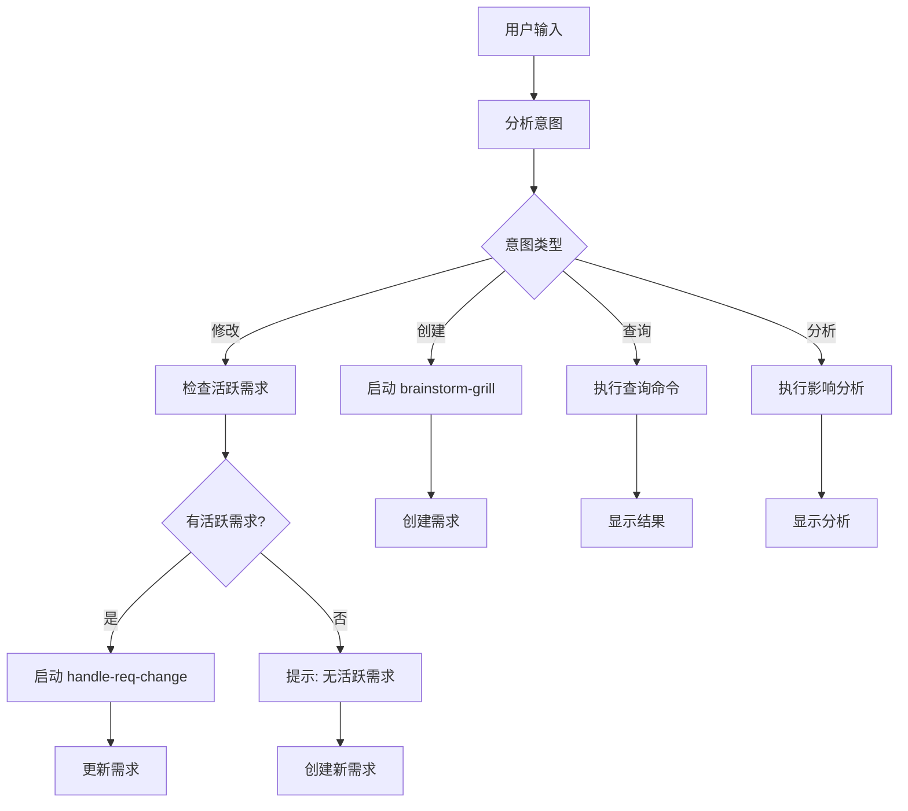

# 需求管理统一入口

根据用户意图自动路由到相应的处理流程，无需用户手动选择具体的 skill。

## 智能路由逻辑

分析用户输入，自动识别意图并选择最优流程：

### 意图识别

| 意图类型 | 关键词 | 路由到 | 触发条件 |
|----------|--------|--------|----------|
| **创建新需求** | 添加、实现、新建、增加、开发 | brainstorm-grill | 匹配创建类关键词 |
| **修改需求** | 修改、改变、调整、更新、改进 | handle-req-change | 匹配修改类关键词 + 存在活跃需求 |
| **查询需求** | 查看、状态、列表、显示、有哪些 | req:query | 匹配查询类关键词 |
| **分析影响** | 影响、依赖、风险、关联 | req:impact | 匹配分析类关键词 |
| **快速修复** | 修复、bug、错误、问题 | req:quick | 匹配修复类关键词 + --quick 或 --bug |

### 自动推断规则

**需求类型推断**：
```
包含"登录"、"注册"、"用户" → feature
包含"bug"、"错误"、"崩溃"、"失败" → bug  
包含"如何"、"怎么"、"为什么" → question
包含"重构"、"优化"、"改进" → refactor
```

**模式推断**：
```
包含"快速"、"简单"、"小"、"马上" → quick
包含"完整"、"详细"、"全面"、"深入" → deep
包含"自动"、"全自动" → auto
默认 → semi_auto
```

## 简化用法

### 优化前 vs 优化后

**优化前**（需要记住多个选项）：
```bash
/req --feature --deep 添加用户登录功能
/req --bug --quick 修复登录崩溃
/req --question 如何实现OAuth？
```

**优化后**（智能推断）：
```bash
/req 添加用户登录功能           # 自动：feature + deep
/req 修复登录崩溃               # 自动：bug + quick  
/req 如何实现OAuth?             # 自动：question + semi
```

## 执行流程



## 使用示例

### 场景1: 创建新功能

```bash
用户: /req 添加用户头像上传功能

系统响应:
[意图识别] 创建新需求 (feature)
[模式推断] 深度分析模式 (deep)
[流程启动] brainstorm-grill...
```

### 场景2: 快速修复

```bash
用户: /req 快速修复登录按钮样式

系统响应:
[意图识别] 修复问题 (bug)
[模式推断] 快速模式 (quick)
[流程启动] 跳过深度分析，直接创建需求...
```

### 场景3: 修改现有需求

```bash
用户: /req 把登录改为OAuth

系统响应:
[意图识别] 修改需求
[检测] 发现活跃需求: REQ-20260513-001 (用户登录功能)
[流程启动] handle-req-change...
```

### 场景4: 查询需求

```bash
用户: /req 查看所有活跃需求

系统响应:
[意图识别] 查询需求
[执行] node .claude/scripts/requirement-manager/index.js --active
```

## 智能提示

当用户意图不明确时，提供引导：

```
你的需求不够明确，请选择：

1. 创建新需求 - 例如："添加用户登录功能"
2. 修改现有需求 - 例如："修改REQ-001的登录方式"
3. 查看需求状态 - 例如："查看活跃需求"
4. 快速修复 - 例如："修复登录bug"

或者使用具体选项：
/req --feature 添加功能
/req --bug 修复问题
/req --quick 快速处理
```

## 集成说明

**替代**：
- 部分替代 `/req` 命令的直接调用
- 作为 `/req` 命令的智能路由层

**与现有 skills 的关系**：
- `brainstorm-grill`: 创建需求时调用
- `handle-req-change`: 修改需求时调用
- `test-plan-generator`: 设计完成后自动调用
- `writing-plans`: 测试计划完成后调用

**调用顺序**：
```
req-manager
  ↓
[创建] → brainstorm-grill → test-plan-generator → writing-plans
[修改] → handle-req-change → [可能需要] brainstorm-grill
[查询] → 查询脚本
[分析] → 分析脚本
```

## 配置选项

可以通过 `.claude/settings.json` 配置默认行为：

```json
{
  "req-manager": {
    "defaultMode": "semi_auto",
    "autoDetect": true,
    "quickThreshold": "简单|小|快速|马上",
    "deepThreshold": "复杂|完整|详细|全面"
  }
}
```

## 错误处理

### 常见错误提示

**错误1: 意图不明确**
```
无法识别你的意图。请明确你要：
- 创建新需求？
- 修改现有需求？
- 查看需求状态？

示例：
/req 添加用户登录功能
/req 修改REQ-001为OAuth
/req --active
```

**错误2: 修改需求但无活跃需求**
```
没有找到活跃的需求分支。

你可以：
1. 查看所有需求: /req --list
2. 创建新需求: /req 添加新功能
3. 指定需求ID: /req 修改 REQ-001 ...
```

## 优势

1. **降低学习成本**
   - 不需要记住所有选项
   - 智能推断减少输入

2. **减少错误**
   - 自动选择合适流程
   - 提供清晰的反馈

3. **提升效率**
   - 跳过不必要的步骤
   - 快速通道处理简单需求

4. **保持灵活性**
   - 仍可使用完整选项
   - 高级用户可精确控制
