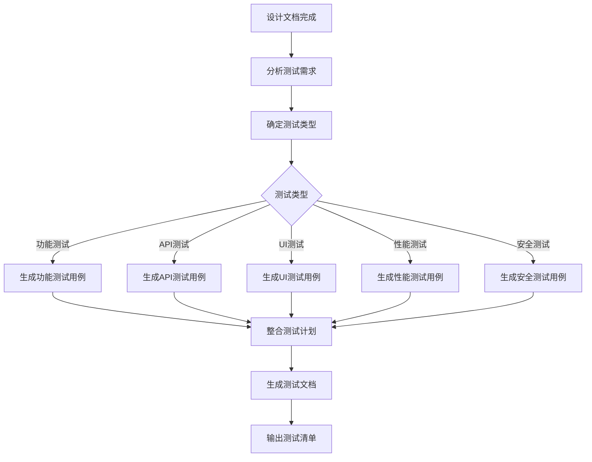

# 测试计划生成器

基于设计文档自动生成完整的测试计划、测试用例和测试文档，确保每个需求都有可执行的测试覆盖。

## 触发条件

- 设计文档完成后自动触发
- 用户明确要求生成测试计划
- 进入实现阶段前的测试准备

## 核心流程



## 测试类型覆盖

### 1. 功能测试 (Functional Testing)

**目标**：验证功能是否符合需求规格

**生成内容**：
- 正常场景测试用例
- 边界值测试用例
- 异常场景测试用例
- 数据验证测试用例

**测试用例模板**：
```markdown
### FC-XXX: [功能名称] 正常场景

**优先级**: P0 (必须)
**前置条件**: [前置条件描述]
**测试步骤**:
1. [步骤1]
2. [步骤2]
3. [步骤3]

**预期结果**: [预期结果]
**实际结果**: [待填写]
**状态**: [待执行/通过/失败]
```

### 2. API 测试 (API Testing)

**目标**：验证 API 接口的正确性

**生成内容**：
- 请求参数验证
- 响应格式验证
- 错误码测试
- 边界条件测试
- 并发请求测试

**测试用例模板**：
```markdown
### API-XXX: [接口名称] 测试

**接口**: [HTTP方法] [路径]
**优先级**: P0
**请求示例**:
```json
{
  "param1": "value1"
}
```

**预期响应**:
```json
{
  "code": 200,
  "data": {}
}
```

**测试场景**:
- 正常请求
- 参数缺失
- 参数类型错误
- 超长参数
- 特殊字符
```

### 3. UI 测试 (UI Testing)

**目标**：验证用户界面的正确性和易用性

**生成内容**：
- 页面元素测试
- 交互流程测试
- 响应式布局测试
- 可访问性测试

**测试用例模板**：
```markdown
### UI-XXX: [页面/组件名称] 测试

**优先级**: P0
**测试元素**: [元素列表]
**交互场景**:
- 点击[按钮] → [预期行为]
- 输入[内容] → [预期反馈]
- 导航到[页面] → [预期状态]

**视觉验证**:
- 布局正确
- 样式一致
- 响应式适配
- 无障碍支持
```

### 4. 性能测试 (Performance Testing)

**目标**：验证系统性能指标

**生成内容**：
- 响应时间测试
- 并发用户测试
- 负载测试
- 压力测试

**测试用例模板**：
```markdown
### PERF-XXX: [性能指标] 测试

**优先级**: P1
**测试指标**: [响应时间/吞吐量/并发数]
**测试条件**: [测试环境配置]
**性能基准**:
- 响应时间 < [X]ms
- 吞吐量 > [X] req/s
- 并发用户 = [X]

**测试场景**:
- 正常负载
- 峰值负载
- 持续负载
```

### 5. 安全测试 (Security Testing)

**目标**：验证系统安全性

**生成内容**：
- 输入验证测试
- 权限控制测试
- SQL 注入测试
- XSS 攻击测试
- CSRF 测试

**测试用例模板**：
```markdown
### SEC-XXX: [安全场景] 测试

**优先级**: P0
**威胁类型**: [威胁类型]
**测试步骤**:
1. [攻击步骤]
2. [验证点]

**预期结果**: [防护措施应生效]
**实际结果**: [待填写]
```

## 测试计划结构

生成的测试文档包含以下部分：

```markdown
# [需求标题] 测试计划

## 1. 测试概述

### 1.1 测试目标
[总体测试目标]

### 1.2 测试范围
- 包含功能: [功能列表]
- 不包含功能: [功能列表]

### 1.3 测试策略
- 测试类型: [类型列表]
- 测试工具: [工具列表]
- 测试环境: [环境描述]

## 2. 功能测试用例

[功能测试用例列表]

## 3. API 测试用例

[API 测试用例列表]

## 4. UI 测试用例

[UI 测试用例列表]

## 5. 性能测试用例

[性能测试用例列表]

## 6. 安全测试用例

[安全测试用例列表]

## 7. 测试数据准备

### 7.1 测试数据
- 正常数据: [数据示例]
- 边界数据: [数据示例]
- 异常数据: [数据示例]

### 7.2 测试环境
- 开发环境: [配置]
- 测试环境: [配置]
- 预发布环境: [配置]

## 8. 测试执行计划

### 8.1 测试阶段
1. 单元测试: [时间安排]
2. 集成测试: [时间安排]
3. 系统测试: [时间安排]
4. 验收测试: [时间安排]

### 8.2 测试里程碑
- 里程碑1: [描述]
- 里程碑2: [描述]

## 9. 测试交付物

- 测试计划文档 ✓
- 测试用例清单 ✓
- 测试数据脚本 ✓
- 测试执行报告 [待执行]
- 缺陷报告 [待执行]

## 10. 风险与应对

| 风险 | 影响 | 概率 | 应对措施 |
|------|------|------|----------|
| [风险1] | [影响] | [高/中/低] | [措施] |
```

## 自动生成规则

### 基于设计文档生成测试用例

**输入**：design.md 中的设计文档

**生成逻辑**：

1. **从功能描述提取测试场景**
   ```
   设计: "用户可以登录系统"
   生成:
   - 正常登录测试
   - 用户名不存在测试
   - 密码错误测试
   - 账号锁定测试
   ```

2. **从 API 定义生成接口测试**
   ```
   设计: "POST /api/login"
   生成:
   - 正常请求测试
   - 参数缺失测试
   - 参数类型错误测试
   - 未授权访问测试
   ```

3. **从数据流生成边界测试**
   ```
   设计: "用户名长度 3-20 字符"
   生成:
   - 2 字符测试（边界外）
   - 3 字符测试（边界内）
   - 20 字符测试（边界内）
   - 21 字符测试（边界外）
   ```

4. **从错误处理生成异常测试**
   ```
   设计: "网络超时重试3次"
   生成:
   - 超时1次测试
   - 超时2次测试
   - 超时3次测试
   - 超时4次失败测试
   ```

### 测试用例优先级规则

| 优先级 | 条件 | 说明 |
|--------|------|------|
| P0 | 核心功能、主要业务流程 | 必须测试，失败则阻塞发布 |
| P1 | 重要功能、常用场景 | 必须测试，失败需评估 |
| P2 | 边缘功能、异常场景 | 尽量测试，失败可延后 |
| P3 | 辅助功能、优化项 | 可选测试 |

## 执行步骤

### 步骤1: 分析设计文档

**读取**：`.requirements/<type>/REQ-XXX/design.md`

**提取**：
- 功能列表
- API 接口定义
- 数据流描述
- 错误处理逻辑
- 性能要求
- 安全要求

### 步骤2: 确定测试类型

**根据设计内容选择测试类型**：
- 有功能描述 → 功能测试
- 有 API 定义 → API 测试
- 有 UI 设计 → UI 测试
- 有性能要求 → 性能测试
- 有安全要求 → 安全测试

### 步骤3: 生成测试用例

**自动生成**：
- 每个功能点至少 3 个测试用例（正常、边界、异常）
- 每个 API 至少 5 个测试用例
- 每个 UI 组件至少 2 个测试用例
- 性能测试根据要求定制
- 安全测试覆盖常见漏洞

### 步骤4: 整合测试计划

**输出文件**：`.requirements/<type>/REQ-XXX/test-plan.md`

**包含内容**：
- 完整的测试计划文档
- 详细的测试用例清单
- 测试数据准备说明
- 测试执行计划

## NEVER 清单

- **绝不**跳过核心功能的测试用例
- **绝不**忽略边界条件测试
- **绝不**省略错误处理测试
- **绝不**忘记性能和安全测试
- **绝不**生成无法执行的测试用例

## 示例

### 输入：设计文档

```markdown
## 功能：用户登录

- 用户通过用户名和密码登录
- 用户名长度 3-20 字符
- 密码最少 8 字符
- 错误 3 次锁定账号 30 分钟

## API：POST /api/login

- 请求：{ username, password }
- 响应：{ token, user }
```

### 输出：测试用例（部分）

```markdown
### FC-001: 用户正常登录

**优先级**: P0
**前置条件**: 用户已注册
**测试步骤**:
1. 输入正确的用户名
2. 输入正确的密码
3. 点击登录按钮

**预期结果**: 登录成功，跳转到首页

### FC-002: 用户名不存在

**优先级**: P0
**测试步骤**:
1. 输入不存在的用户名
2. 输入任意密码
3. 点击登录按钮

**预期结果**: 显示"用户名不存在"错误提示

### FC-003: 密码错误

**优先级**: P0
**测试步骤**:
1. 输入正确的用户名
2. 输入错误的密码
3. 点击登录按钮

**预期结果**: 显示"密码错误"提示，错误次数+1

### FC-004: 账号锁定

**优先级**: P0
**前置条件**: 用户已连续错误 2 次
**测试步骤**:
1. 输入正确的用户名
2. 输入错误的密码（第3次）
3. 点击登录按钮

**预期结果**: 账号被锁定30分钟，显示锁定提示

### FC-005: 用户名边界值

**优先级**: P1
**测试步骤**:
1. 输入2字符用户名
2. 输入正确密码
3. 点击登录按钮

**预期结果**: 显示"用户名长度必须在3-20字符之间"

### API-001: 正常登录请求

**优先级**: P0
**接口**: POST /api/login
**请求示例**:
```json
{
  "username": "testuser",
  "password": "password123"
}
```

**预期响应**:
```json
{
  "code": 200,
  "data": {
    "token": "xxx",
    "user": {...}
  }
}
```

### API-002: 参数缺失

**优先级**: P0
**请求示例**:
```json
{
  "username": "testuser"
}
```

**预期响应**:
```json
{
  "code": 400,
  "message": "password is required"
}
```
```

## 集成说明

**触发时机**：
- 设计文档完成后自动触发
- 在 `writing-plans` 之前生成测试计划

**相关 skills**：
- **brainstorm-grill**: 生成设计文档
- **writing-plans**: 生成实现计划（参考测试计划）
- **test-driven-development**: 如果使用 TDD，结合本 skill

**输出文件**：
- `.requirements/<type>/REQ-XXX/test-plan.md` - 完整测试计划
- `.requirements/<type>/REQ-XXX/test-cases.md` - 测试用例清单（可选）

## 下一步

测试计划生成后：
1. 用户审查测试计划
2. 根据反馈调整测试用例
3. 进入实现阶段时参考测试计划
4. 执行测试并记录结果
