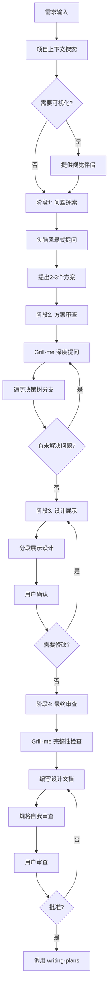

# 深度需求分析模式

当用户提出需求时，启动本模式进行深度分析。此模式结合了 `brainstorming`（协作式设计）和 `grill-me`（对抗式审查）两种方法的优势，确保需求分析既全面又深入。

## 触发条件

- 用户提出新需求或功能请求
- 用户要求"分析需求"、"设计方案"
- 用户提到"grill me"、"审查我的设计"
- 需求涉及多个子系统或复杂交互

## 核心理念

**双轮驱动**：
1. **发散（Brainstorming）** - 通过协作式提问，探索可能性和设计方案
2. **收敛（Grill-me）** - 通过对抗式审查，验证设计的合理性和完整性

## 流程图



## 三个阶段

### 阶段1: 问题探索（Brainstorming 主导）

**目标**：理解需求本质，探索可能方案

**执行方式**：
1. 探索项目上下文（文件、文档、最近提交）
2. 如果涉及视觉内容，单独一条消息提供视觉伴侣
3. **一次一个问题**地提问，聚焦于：
   - 目的/动机（为什么要做？）
   - 约束条件（技术、时间、资源）
   - 成功标准（如何衡量完成？）
   - 边界范围（什么不做？）

4. 提出 2-3 个备选方案，说明：
   - 每个方案的核心思路
   - 优缺点对比
   - 推荐方案及理由

**关键原则**：
- 优先使用多选题（更易回答）
- 每次只问一个问题
- 如果可通过探索代码库回答，就去探索

---

### 阶段2: 方案审查（Grill-me 主导）

**目标**：深度验证方案，遍历决策树

**执行方式**：
在选定方案后，启动 Grill-me 模式进行深度审查：

1. **逐分支审查**：针对方案中的每个关键决策点
2. **压力测试**：挑战假设，寻找漏洞
3. **依赖分析**：明确决策间的依赖关系
4. **提供推荐答案**：每个问题都给出建议答案

**典型审查维度**：
- 架构合理性
- 技术选型
- 数据流完整性
- 错误处理
- 性能影响
- 安全考虑
- 可维护性
- 测试覆盖

**关键原则**：
- 一次一个问题，等待回答后再继续
- 优先探索代码库获取答案
- 不接受"以后再说"——要么决策，要么明确标注为开放问题
- 持续直到所有主要分支都有决策

---

### 阶段3: 设计展示（Brainstorming 主导）

**目标**：结构化展示设计，获得批准

**执行方式**：
1. 分段展示设计（架构、组件、数据流、错误处理、测试）
2. 每段展示后确认是否正确
3. 根据反馈调整
4. 规模适配：简单的几句话，复杂的200-300字

**关键原则**：
- 按复杂度调整每段篇幅
- 逐段确认，不一次性全部展示
- 保持开放性，随时回退澄清

---

### 阶段4: 最终审查（Grill-me 主导）

**目标**：完整性检查，确保没有遗漏

**执行方式**：
1. 扫描设计文档：
   - 占位符（TBD、TODO）
   - 内部矛盾
   - 范围是否清晰
   - 模糊需求

2. Grill-me 完整性质疑：
   - 错误场景是否覆盖？
   - 边界条件是否考虑？
   - 依赖项是否明确？
   - 回滚策略是什么？

3. 生成决策摘要：
   - 所做决策
   - 每个决策的理由
   - 开放问题列表

**关键原则**：
- 内联修复发现的问题
- 修复后无需重新审查，直接继续
- 确保所有分支都有决策

---

## 文档输出

**设计文档位置**：`docs/superpowers/specs/YYYY-MM-DD-<topic>-design.md`

**文档结构**：
```markdown
# [主题] 设计文档

## 背景
- 问题/机会描述
- 成功标准

## 方案选择
- 备选方案对比
- 选择方案及理由

## 架构设计
- 系统架构
- 组件划分
- 接口定义

## 数据流
- 正常流程
- 异常处理

## 技术决策
- 技术选型
- 关键决策及理由

## 测试策略
- 测试类型（功能/API/UI/性能/安全）
- 关键测试场景
- 测试覆盖率要求
- 性能基准
- 安全验证点

**注意**：此部分将由 `test-plan-generator` skill 自动扩展为完整的测试计划文档

## 开放问题
- 待决策事项
- 风险项
```

---

## 退出条件

同时满足以下条件方可进入实现阶段：

1. ✅ 所有关键分支都有明确决策
2. ✅ 设计文档已编写并提交
3. ✅ 规格通过自我审查（无占位符、无矛盾、范围清晰）
4. ✅ 用户已审查并批准设计文档
5. ✅ 可以完整陈述决策树和理由

**验证问题**：
> "我能否完整复述这个设计的所有决策及其理由？如果不能，还有什么需要澄清的？"

---

## NEVER 清单

- **绝不**一次问多个问题——一次一个问题，等待回答
- **绝不**接受"以后再说"——要么决策，要么标注为开放问题
- **绝不**在设计未批准前进入实现
- **绝不**跳过代码库探索——能从代码获取的就不问用户
- **绝不**批量展示设计——逐段确认
- **绝不**让用户重定向到实现直到设计分支全部解决

---

## 处理"我不知道"

当用户回答"我不知道"时：

1. **提供推荐答案**："基于[原因]，我建议[X]，因为..."
2. **询问是否接受**："这个方向可以吗？"
3. **如果接受**：记录决策并继续
4. **如果拒绝**：提供替代方案或说明需要研究的内容

---

## 示例对话

**阶段1（头脑风暴）**：
> AI: 这个需求的核心目标是什么？是为了解决[问题A]还是[问题B]？
> 用户: 主要是解决问题A
> AI: 明白了。关于实现方式，我看到三种可能：(A) 方案一，优点是...缺点是...；(B) 方案二...；(C) 方案三...。基于[分析]，我推荐方案A，因为...

**阶段2（Grill-me）**：
> AI: 让我深入审查一下方案A。首先，关于[组件X]的边界——它应该负责[Y]还是[Z]？
> 用户: 应该负责Y
> AI: 好的。那如果发生[边界情况E]，组件X应该如何处理？我建议[E]，因为...

**阶段4（最终审查）**：
> AI: 最后检查一下——我看到设计文档中没有提到[错误场景F]的处理。这种情况应该怎么处理？
> 用户: 嗯，没考虑到
> AI: 基于系统其他部分的模式，我建议[G]...这样可以吗？

---

## 下一步

设计批准后，调用 `writing-plans` skill 创建实现计划。

**不要调用**任何实现相关 skill（frontend-design、mcp-builder 等）。
